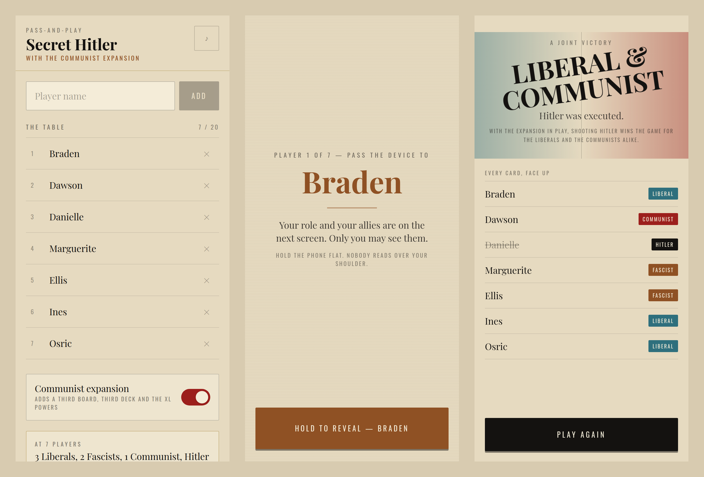

<div align="center">

# Secret Hitler XL

**A pass-and-play adaptation of Secret Hitler that installs to your phone and works with the radio off.**

[](https://github.com/Zlol-Itrpg/secret-hitler-pwa/actions/workflows/test.yml)


[](LICENSE)



<sub>Setup · a covered handoff · the reckoning</sub>

</div>

---

## What this is

One phone, passed around a table. No accounts, no lobby codes, no server, no
second device. The app deals the roles, guards every secret behind a
hand-it-to-me screen, counts the ballots, runs the board, and tells you who won.

It plays the base game and the fan-made **Communist (XL) expansion**, which adds
a third policy track, a third deck and its own presidential powers. Four to
twenty players either way — five to ten is the official base-game range, and the
setup screen marks anything outside it as a house rule.

Everything runs in the browser. Install it once and it never needs the network
again.

## Features

- **Zero backend.** No database, no API, no accounts. The entire game is one
  `useReducer` store of plain serialisable data, saved to `localStorage`. Close
  the tab mid-ballot and reopen it; you resume on the same player's turn.
- **Real privacy.** Hidden information only reaches the screen through an
  interstitial that names the recipient and refuses to render the payload until
  they confirm. The secret is never in the DOM early — there is nothing to
  glimpse from across the table.
- **A state machine, not a pile of flags.** Nine phases, one pure reducer.
  Components dispatch and render; they decide nothing. The turn loop, term
  limits, the veto exchange and every executive power live in one place that
  can be tested without a browser.
- **Synthesised audio, no files.** Every sound is built at runtime from
  oscillators and noise buffers via the Web Audio API — a paper shuffle, a
  stamp thud, a gavel, a heartbeat, and a different fanfare per victory. Nothing
  to precache, nothing to buffer, no latency.
- **Haptics.** 15 ms on a tap, 40 on a vote, 100 on a policy or an execution,
  a double pulse on game over. Silently absent where the device has no motor.
- **Motion that respects the setting.** CSS keyframes — 3D card flips, a policy
  slamming into its slot, staggered ballot reveals — all neutered by a single
  `prefers-reduced-motion` block.
- **Installable and portrait-locked**, so a handoff can't rotate the layout or
  navigate away mid-turn.

## Play it

### Deploy your own copy

The build is static files — any host works, and these two need no
configuration. Both read private repositories once you authorise their GitHub
app, so this works whether or not the repository is public. If it *is* public
and not yours, fork it first and import the fork.

**Vercel**

1. Go to [vercel.com/new](https://vercel.com/new) and import this repository.
2. Vercel detects Vite on its own. Click **Deploy**.

**Netlify**

1. Go to [app.netlify.com/start](https://app.netlify.com/start) and pick this
   repository.
2. Build command `npm run build`, publish directory `dist`. Click **Deploy**.

Either gives you an `https://…` link. HTTPS matters: service workers refuse to
register without it, and without the service worker there is no offline mode.

> A private repository does not make the deployment private. The URL either
> host gives you is reachable by anyone who has it. That is usually what you
> want — the people at the table need to open it — but it is worth knowing
> before you paste the link anywhere public.

### Install it on the phone that will be passed around

**Android (Chrome)** — open the link, then either accept the *Install app*
prompt or use **⋮ → Add to Home screen**.

**iPhone / iPad (Safari)** — open the link, tap **Share**, then **Add to Home
Screen**. It must be Safari; other iOS browsers do not offer this.

Launch it from the home-screen icon rather than the browser. It opens without a
URL bar, locks to portrait, and from then on works in aeroplane mode.

> The first launch needs a connection so the service worker can cache the app.
> Do that once before the game night, not during it.

## Local development

```bash
git clone https://github.com/Zlol-Itrpg/secret-hitler-pwa.git
cd secret-hitler-pwa
npm install
npm run dev
```

| Command | What it does |
| --- | --- |
| `npm run dev` | Dev server with hot reload |
| `npm run build` | Production build into `dist/` |
| `npm run preview` | Serve `dist/` over http — **use this to test PWA behaviour** |
| `npm test` | Every headless suite |
| `npm run test:e2e` | Browser suites: install metadata, offline play, touch targets |
| `npm run icons` | Re-render the icon PNGs from `public/icon.svg` |

The service worker only exists in a production build, so install and offline
behaviour must be checked against `preview`, never `dev`.

Requires Node 22+.

## Testing

The interesting part of a hidden-role game is the rules, and rules are exactly
what a browser is bad at testing. So the state machine is a pure function with
no React in it, and most of the suite runs headless in milliseconds.

```
$ npm test

test/unit/audio-haptics.mjs               50 passed
test/unit/ballot-loop.mjs                 25 passed
test/unit/executive-powers.mjs            59 passed
test/unit/legislative.mjs                 46 passed
test/unit/lifecycle-audit.jsx             25 passed
test/unit/reducer-fuzz.mjs                ok
test/unit/role-intel.mjs                  ok
test/unit/storage.mjs                     44 passed
test/ui/executive-powers.jsx              50 passed
test/ui/hud-nomination-voting.jsx         86 passed
test/ui/legislative-session.jsx           46 passed
test/ui/persistence-and-reset.jsx         45 passed
test/ui/setup-and-reveal.jsx              82 passed

----------------------------------------------------------
13 suites   558 assertions passed   0 failed
all green
```

**The fuzzer.** `reducer-fuzz.mjs` plays **600 complete games** at every table
size from 4 to 20, choosing randomly at every decision. After each transition it
asserts that no policy card was created or lost, that the game never livelocks,
that a nomination never runs out of legal candidates, and that no handoff ever
addresses a dead player. All five win conditions occur; every power fires; the
chaos and veto branches are exercised.

**Role intel.** 24,480 individual reveals check that each role sees exactly the
allies it should — Fascists see Hitler, Hitler goes blind at seven players,
Communists see their own cell, Liberals see nothing — and that no player is ever
listed as their own ally.

**UI.** jsdom suites drive the real components: validation gates, the seven role
reveals, six ballots, the full legislative session including both veto answers,
and all six powers. At every handoff they assert the overlay is opaque and its
subtree names only the recipient.

**Browser.** `npm run test:e2e` builds, serves and drives Chromium at Pixel 8
size: manifest and iOS install metadata, service-worker registration, then the
network is cut and a full deal-and-reveal is played offline. It also measures
every touch target against the 48 px minimum.

No test framework — the suites are plain Node scripts that print `PASS`/`FAIL`
and set an exit code. There is no config to keep in step with a toolchain, and
they run anywhere Node runs.

## Project layout

```
src/
  game/          the state machine — reducer, selectors, storage, context
  components/    screens; they dispatch and render, and decide nothing
  utils/         audio synthesis, haptics
test/
  unit/          headless: rules, storage, audio, lifecycle
  ui/            jsdom: the components, driven end to end
  e2e/           Playwright: the built PWA in a real browser
docs/
  ARCHITECTURE.md   how the turn loop, powers and persistence actually work
```

Start with [`docs/ARCHITECTURE.md`](docs/ARCHITECTURE.md) — it covers the phase
diagram, the ballot loop, the power schedule, the privacy rule and the
persistence model.

## Bundle

| | |
| --- | --- |
| JS | 274 kB raw / **81 kB gzipped** |
| CSS | 28 kB raw / 6 kB gzipped |
| Precached | 18 entries, 459 KiB including self-hosted fonts |
| Runtime dependencies | React, React-DOM, two fonts. That's it. |

No animation library, no audio files, no state-management package, no UI kit.

## Contributing

Issues and pull requests are welcome. `npm test` must be green, and a change to
the rules needs a test that fails without it. The reducer stays pure — if a
change wants to reach for `Date.now()`, `Math.random()` or the DOM inside it,
that logic belongs somewhere else.

## Legal & attribution

**This is a free, fan-made adaptation. It is not an official product, and it is
not affiliated with or endorsed by the creators of Secret Hitler.**

*Secret Hitler* was created by **Mike Boxleiter, Tommy Maranges and Max
Temkin**, illustrated by **Mac Schubert**, and published by **Goat, Wolf &
Cabbage LLC**. The original game is released under a
[Creative Commons Attribution-NonCommercial-ShareAlike 4.0 International
license](https://creativecommons.org/licenses/by-nc-sa/4.0/) — you can find it
at [secrethitler.com](https://www.secrethitler.com/).

The Communist expansion adapted here is **Secret Hitler XL**, a fan-made
expansion created by the Secret Hitler community and shared under the same
terms.

This adaptation is licensed under the same
[CC BY-NC-SA 4.0](LICENSE) license, as the ShareAlike term requires:

- **Attribution** — credit the original creators, as above.
- **NonCommercial** — you may not use this, or the original game, commercially.
- **ShareAlike** — anything you build on this must carry the same license.

If you enjoy the game, [buy a physical copy](https://www.secrethitler.com/) or
print your own — the designers make the print-and-play files free.
